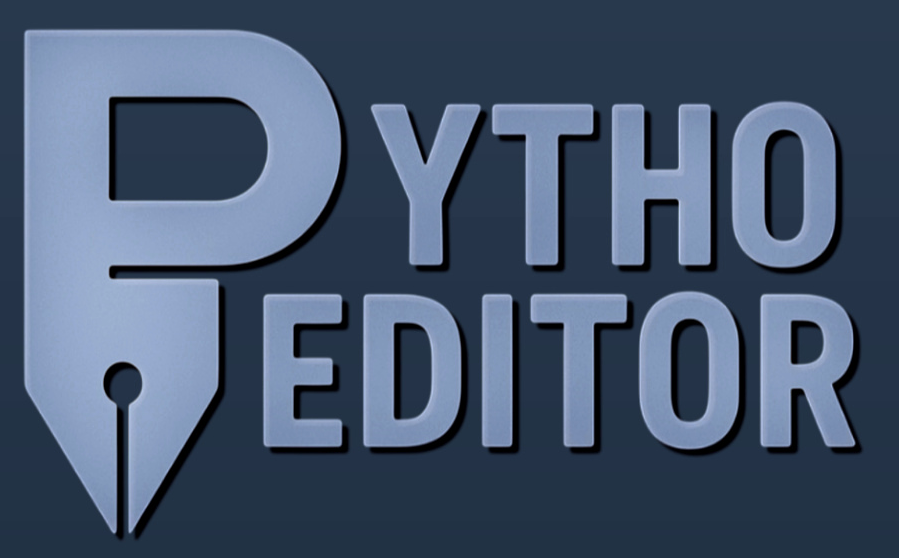

# 🖼️ PythoEditor

**PythoEditor**는 간단한 GUI 기반의 이미지 편집 도구입니다.  
초보자도 직관적으로 사용할 수 있도록 설계되었으며, 주요 이미지 필터와 효과를 손쉽게 적용할 수 있습니다.

  

## 🎬 소개 영상
[](https://www.youtube.com/watch?v=cFqQS-OgYSI)

클릭 시, 유튜브로 이동합니다.

---

## 🛠️ 주요 기능

- ✅ **흑백 변환**: 컬러 이미지를 간단히 흑백으로 전환  
- ✅ **밝기 조절**: 슬라이더를 통해 -255 ~ +255 범위 내에서 밝기 조절  
- ✅ **크기 조절**: 원하는 가로/세로 픽셀 입력으로 이미지 사이즈 조정  
- ✅ **회전**: 각도(정수) 입력으로 자유롭게 회전  
- ✅ **대칭 반전**: 좌우 및 상하 반전 가능  
- ✅ **색상 반전**: 이미지 색상을 반전  
- ✅ **엣지 검출**: Canny 엣지 검출로 윤곽 강조  
- ✅ **블러**: 약하게/중간/강하게 3단계 Gaussian 블러 적용  
- ✅ **채널 분리**: R, G, B 채널 각각 분리 출력  

---

## 📁 기타 기능

- 🖼️ **새 이미지 생성**: 원하는 해상도와 배경색으로 초기 이미지 생성  
- 🗑️ **이미지 삭제**: 저장된 이미지 선택 후 삭제 가능  
- 🔁 **Undo / Redo**: 편집 기록을 기반으로 되돌리기, 다시 실행 가능  
- 💾 **저장**: 현재 작업 이미지를 기존 경로에 저장  
- 🔊 **배경 음악**: 메인 화면 및 편집 화면에서 자동 재생 (main_theme.wav)  
- 🖱️ **Pygame GUI 기반**: 직관적인 마우스 인터페이스 지원

---

---

## 🚀 실행 방법

### 🔧 Python 환경에서 실행 (권장 방식)

1. **Python 3.10 이상**이 설치되어 있어야 합니다.
2. 필요한 패키지를 설치합니다:

```bash
pip install pygame opencv-python numpy
```

3. 터미널(cmd, PowerShell 등) 또는 VS Code에서 **`main.py`가 있는 폴더로 이동한 뒤**, 아래 명령어를 실행합니다:

```bash
python main.py
```

> ⚠️ `assets`, `images`, `lib` 폴더는 `main.py`와 동일한 경로에 있어야 합니다.  
> ⚠️ 터미널의 **작업 디렉토리(current working directory)**는 반드시 `main.py`가 위치한 폴더여야 합니다.

> 예시:
> ```bash
> cd PythoEditor
> python main.py
> ```

---

### 실행 파일 제작 시 참고 (선택 사항)

- 실행 파일은 **PyInstaller**를 사용해 만들 수 있습니다.
- 이 경우, 아래 폴더들을 함께 배포해야 합니다:
  - `assets` : 배경 이미지, 폰트, 사운드 등 리소스
  - `images` : 이미지 저장 폴더
  - `lib` : 내부 기능 모듈들

```bash
pyinstaller main.py --noconsole --onefile
```

> ⚠️ 실행 파일(`.exe`)은 용량이 매우 클 수 있으며, 이 프로젝트는 `.py` 실행을 권장합니다.

---


---

## 📦 폴더 구조

```
PythoEditor/
├── assets/            # 배경 이미지, 사운드, 폰트 등
│   ├── click.wav
│   ├── edit_mode.png
│   ├── main_theme.wav
│   ├── SCDream7.otf
│   └── title_screen.png
├── images/            # 유저가 만든 이미지 저장 경로 (최대 20개)
├── lib/
│   ├── __init__.py
│   ├── edit_mode.py   # 편집 모드 메인 기능
│   ├── mainMenu.py    # 메인 화면
│   ├── settings.py    # 설정 값들
│   ├── tempCodeRunnerFile.py
│   └── ui_components.py
└── main.py            # 실행 진입점
```

---

## 📝 사용 방법

1. `main.py`를 실행하여 메인 메뉴 진입
2. 새 이미지 생성 또는 이미지 선택 후 편집 시작
3. 좌측 기능 버튼 클릭 → 필요시 우측 입력 영역 사용
4. 편집 완료 후 [저장] 버튼 클릭

---

## 📌 미리보기

| 기능 | 이미지 예시 |
|------|--------------|
| 흑백 변환 |  |
| 밝기 조절 |  |
| 엣지 검출 |  |

> 위 이미지는 `docs/images`에 저장해 함께 배포하면 됩니다.

---

## 📣 라이선스

본 프로젝트는 MIT 라이선스를 따릅니다. 자유롭게 사용하고, 수정 및 배포할 수 있습니다.

---

**즐거운 이미지 편집 되세요!** 🎨
